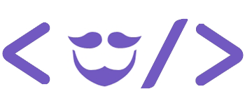

# GoBarber

<h1 align="center">
    
</h1>

<h4 align="center">
 Software completo paragendamento de serviço de beleza
</h4>

<p align="center">
  
  
  
  
  
  

  

  

  

</p>

## Infomações

- [Software Web](#software-web)

  - [Como usar](#como-usar-para-web)
  - [Screenshots](#screenshots-web)

- [Software Mobile](#software-mobile)

  - [Como usar](#como-usar-para-mobile)
  - [Screenshots](#screenshots-mobile)

- [Servidor](#como-usar-o-servidor)

  - [Como usar](#como-usar-o-servidor)
  - [Screenshots](#screenshots-servidor)

- [Tecnologias](#tecnologias)

## Software Web

### Como usar para web

```bash
# Clone este repositório
$ git clone https://github.com/lsm-5/GoBarber.git

# Vá para a seguinte pasta

$ cd FrontWeb

# Instale as depedências

$ yarn install

# Inicialize o software

$ yarn start

```

### Screenshots web

<p align="center">
  
  
  
  
  
  

  

</p>

## Software mobile

### Como usar para mobile

```bash
# Clone este repositório
$ git clone https://github.com/lsm-5/GoBarber.git

# Vá para a seguinte pasta
$ cd FrontMobile

# Instale as depedências
$ yarn install

# Inicialize o software (android ou ios)
$ react-native run-android
$ react-native run-ios
```

### Screenshots mobile

<p>
  
  
  
  
  
  

  

  

  

  

</p>

## Servidor

### Como usar o servidor

```bash
# Clone este repositório
$ git clone https://github.com/lsm-5/GoBarber.git

# Vá para a seguinte pasta
$ cd Server

# Instale as depedências
$ yarn install

# Inicialize o software (android ou ios)
$ yarn dev
```

### Screenshots servidor

<p align="center">
  
  
  
  
  
  

  

</p>

## Tecnologias

Este projeto foi desenvolvido baseado nas atividades da [RocketSeat GoStack Bootcamp](https://rocketseat.com.br/bootcamp) com as seguintes tecnologias:

- [Axios](https://github.com/axios/axios)
- [date-fns](https://date-fns.org/)
- [History](https://www.npmjs.com/package/history)
- [Immer](https://github.com/immerjs/immer)
- [Polished](https://polished.js.org/)
- [ReactJS](https://reactjs.org/)
- [Redux](https://redux.js.org/)
- [Redux-Saga](https://redux-saga.js.org/)
- [React Router v4](https://github.com/ReactTraining/react-router)
- [react-perfect-scrollbar](https://github.com/OpusCapita/react-perfect-scrollbar)
- [React-Toastify](https://fkhadra.github.io/react-toastify/)
- [Reactotron](https://infinite.red/reactotron)
- [styled-components](https://www.styled-components.com/)
- [React-Icons](http://react-icons.github.io/react-icons/)
- [Unform](https://github.com/Rocketseat/unform)
- [VS Code][vc] com [EditorConfig][vceditconfig] e [ESLint][vceslint]
- [Yup](https://www.npmjs.com/package/yup)

Feito com ♥ por Lucas Mendonça [Contato](https://www.linkedin.com/in/lucas-mendon%C3%A7a-12181a187/)

[nodejs]: https://nodejs.org/
[yarn]: https://yarnpkg.com/
[vc]: https://code.visualstudio.com/
[vceditconfig]: https://marketplace.visualstudio.com/items?itemName=EditorConfig.EditorConfig
[vceslint]: https://marketplace.visualstudio.com/items?itemName=dbaeumer.vscode-eslint
